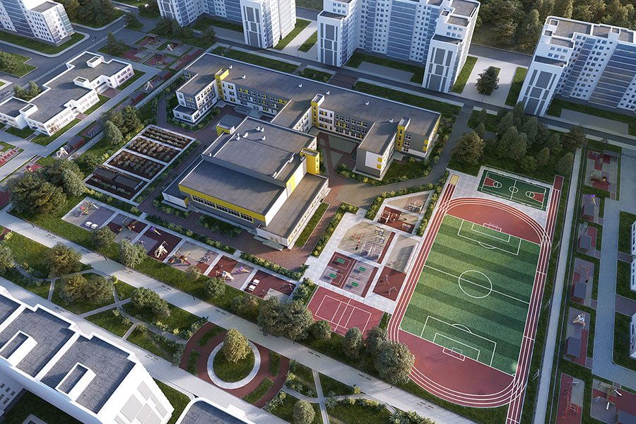
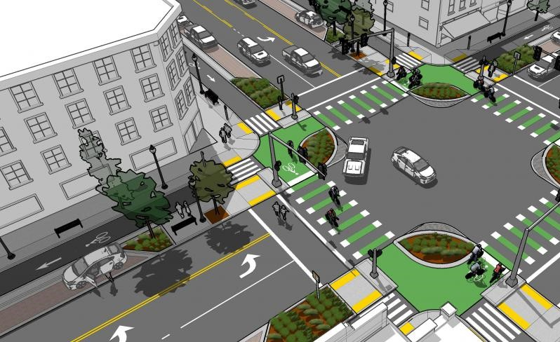
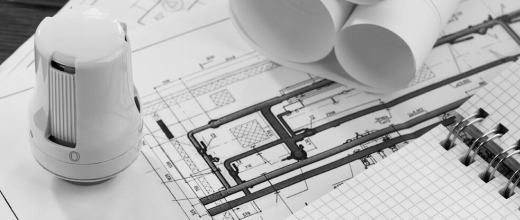
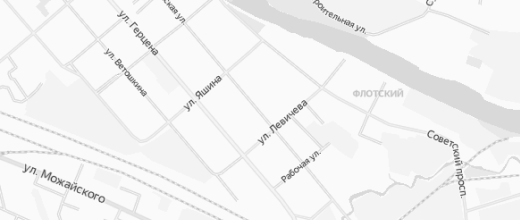
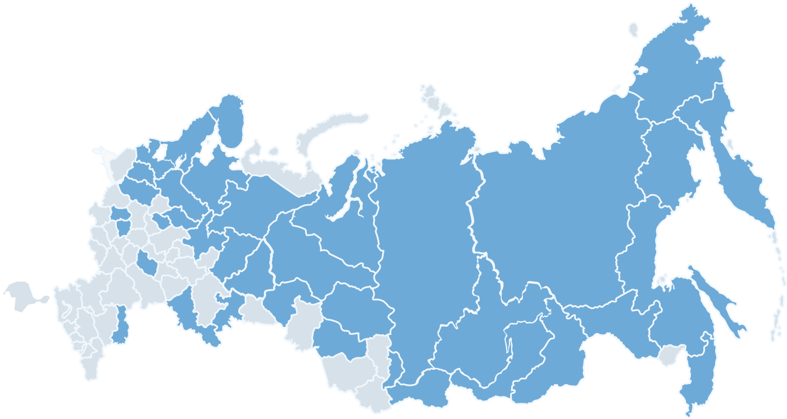
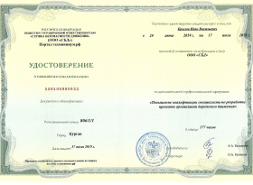
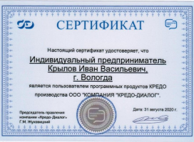
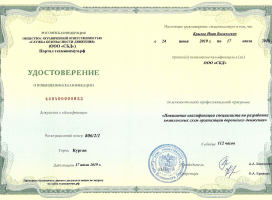
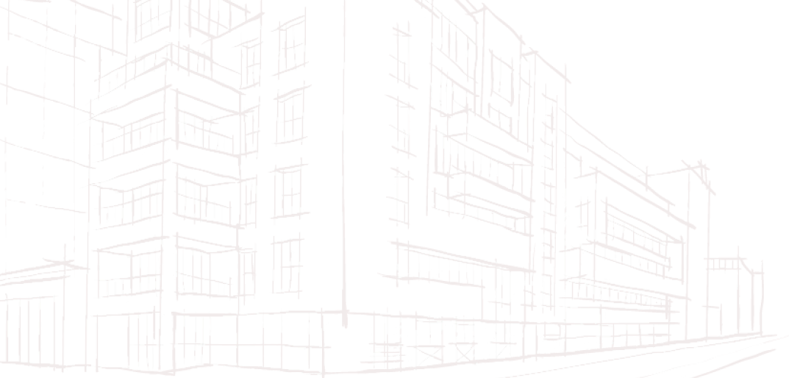

<html>

<head>
    <title>Главная</title>
    <meta charset="UTF-8">
    <link rel="stylesheet" href="normalize.css">
    <link rel="stylesheet" href="style.css">
    <link rel="preconnect" href="https://fonts.googleapis.com">
    <link rel="preconnect" href="https://fonts.gstatic.com" crossorigin>
    <link
        href="https://fonts.googleapis.com/css2?family=Ubuntu:ital,wght@0,300;0,400;0,500;0,700;1,300;1,400;1,500;1,700&display=swap"
        rel="stylesheet">
    <link rel="stylesheet" href="https://cdn.jsdelivr.net/npm/swiper@11/swiper-bundle.min.css" />
    <meta name="viewport" content="width=device-width, initial-scale=1">

</head>
<!--пока все ссылки ведут на сайт placestart-->

<body>
    <header>
        

            

                
                <nav id="mainnav" class="mainnav">
                    <ul class="menu">
                        <li><a href="overview.html">О компании</a></li>
                        <li class="programs"><a href="#">Услуги</a>
                            <ul class="submenu">
                                <li><a href="services.html">ЖКХ</a></li>
                                <li><a href="services-single.html">Дорожное хозяйство</a></li>
                                <li><a href="services-single.html">Архитектура</a></li>
                                <li class="programs"><a href="#">Программы</a>
                                    <ul class="submenu">
                                        <li><a href="#">Программа комплексного развития систем коммунальной
                                                инфраструктуры (ПКРСКИ)</a></li>
                                        <li><a href="#">Программа комплексного развития транспортной инфраструктуры
                                                (ПКРТИ)</a></li>
                                        <li><a href="#">Программа комплексного развития социальной инфраструктуры
                                                (ПКРСИ)</a></li>
                                        <li><a href="#">Программа энергосбережения и повышения энергетической
                                                эффективности (ПЭ)</a></li>
                                    </ul>
                                </li>
                            </ul>
                        </li>
                        <li><a href="case-v1.html">Контакты</a>
                        </li>

                    </ul>
                </nav>

                
                
                

                    +7 (911) 501-35-32
                

                

                    8 (8172) 50-35-32
                

                <a href="https://place-start.ru/" class="header_href_btn">
                    <button class="btn_zayavka" id="ostav_zayavku">Оставить заявку</button>
                </a>
            

        

    </header>
    <section class="section1">
        

            

                

                    <h1 class="zagolovok_razrabotka">Разработка и актуализация проектов в сфере ЖКХ</h1>
                    <a href="https://place-start.ru/" class="section1_href_btn">
                        <button class="btn_posmotret_uslugi">Посмотреть услуги</button>
                    </a>
                    

                        

                            
                        

                        

                            
                        

                    

                

                

                    <!-- Additional required wrapper -->
                    

                        <!-- Slides -->
                        

                            
                        

                        

                            
                        

                        

                            
                        

                    

                

            

        

    </section>

    <section class="section2">
        

            

                

                    
Преимущества
                    

                    <h1 class="komanda_text">Наша команда</h1>
                    <ul class="preimuchestva_spisok">
                        <li class="tochki">
                            
Регулярно взаимодействует с клиентом на всех этапах –  Ваш
                                персональный
                                менеджер всегда готов ответить на Ваши вопросы  и помочь в выборе необходимого
                                проекта
                            

                        </li>
                        <li class="tochki">
                            
Строго соблюдает сроки проектирования

                        </li>
                        <li class="tochki">
                            
Разрабатывает качественную проектную документацию,  соответствующую
                                всем требованиям законодательства РФ

                        </li>
                        <li class="tochki">
                            
Гарантирует актуальность работ, так как наши специалисты постоянно
                                отслеживают нормативную базу

                        </li>
                        <li class="tochki">
                            

                                Работает по всей России

                        </li>
                        <li class="tochki">
                            
Заботится о том, чтобы наши клиенты были довольны результатом работы
                            

                        </li>
                    </ul>
                

                

                    

                        
7лет
                        

                        

                            
успешной работы  по всей России

                        

                    

                    

                        
803

                        

                            
проекта успешно  выполнены

                        

                    

                    

                        
442

                        

                            
клиента остались  довольны

                        

                    

                

            

        

    </section>
    <section class="section3">
        

            

                
Компания оказывает услуги  в следующих сферах

                

                    <a class="zhkh" href="https://place-start.ru/">
                        

                            
                        

                        

                        
ЖКХ

                    </a>
                    <a class="doroga" href="https://place-start.ru/">
                        

                            
                        

                        

                        
Дорожное хозяйство

                    </a>
                

                

                    <a class="arhitectura" href="https://place-start.ru/">
                        

                            
                        

                        

                        
Архитектура

                    </a>
                    <a class="programmy" href="https://place-start.ru/">
                        

                            
                        

                        

                        
Программы

                    </a>
                

            

        

    </section>
    <section class="section4">
        

            

                
Рост компании

                
Выполненных проектов

                

                    

                        
4

                        

                    

                    

                        
9

                        

                    

                    

                        
82

                        

                    

                    

                        
50

                        

                    

                    

                        
203

                        

                    

                    

                        
247

                        

                    

                    

                        
245

                        

                    

                

                

                    
2014

                    
2015

                    
2016

                    
2017

                    
2018

                    
2019

                    
2020

                

            

        

    </section>
    <section class="section5">
        

            

                
Этапы работы

                

                    

                        
                        

                            
Консультация клиента

                            
Наш специалист поможет в выборе необходимого проекта,
                                который актуален для Вас на сегодняшний день
                            

                        

                    

                    
                    

                        
                        

                            
Заключение договора

                            
Обсуждение и согласование индивидуальных условий работы и оплаты
                            

                        

                    

                    
                    

                        
                        

                            
Сбор исходной информации

                            
Технический специалист свяжется с Вами и
                                поможет решить все вопросы по сбору данных

                        

                    

                

                

                    

                        
                        

                            
Разработка  и согласование проекта

                            
Проект разрабатывается с учётом всех предложений и
                                отправляется Заказчику на согласование

                        

                    

                    
                    

                        
                        

                            
Подписание акта  и оплата счета

                            
После успешного согласования проекта, Заказчик оплачивает
                                оказанные услуги

                        

                    

                

            

        

    </section>
    <section class="section6">
        

            

                
Карта оказания услуг

                
Компания 5С-проект оказывает услуги  по всей России

                <a href="https://place-start.ru/" class="href_btn">
                    <button class="btn_karta">Оставить заявку</button>
                </a>
            

            
        

    </section>
    <section class="section7">
        

            

                

                    
Удостоверения и сертификаты

                    

                        

                            
                        

                        

                            
                        

                    

                

                

                    

                        <!-- Additional required wrapper -->
                        

                            <!-- Slides -->
                            

                                
                            

                            

                                
                            

                            

                                
                            

                            

                                
                            

                            

                                
                            

                            

                                
                            

                            <!-- Add more slides here -->
                        

                        

                    

                

            

        

    </section>
    <section class="section8">
        <!--  -->
        

            

                

                    
Мы готовы к сотрудничеству

                    
Оставьте заявку на сайте, наши менеджеры свяжутся с Вами и
                        проконсультируют по всем интересующим вопросам

                

                

                    <form class="forma_svyazi">
                        

                            <input class="name_org" placeholder="d">
                            <label class="placeholder">Наименование организации</label>
                        

                        

                            <input class="name_org" placeholder="d">
                            <label class="placeholder">Контактное лицо</label>
                        

                        

                            <input class="name_org" placeholder="d">
                            <label class="placeholder">Телефон</label>
                        

                        

                            <input class="name_org" placeholder="E-mail">
                            <label class="placeholder">E-mail</label>
                        

                    </form>
                    

                        <a href="https://place-start.ru/" class="href_btn">
                            <button class="btn_otpr">Отправить</button>
                        </a>
                        
Нажимая кнопку, Вы
                            соглашаетесь на обработку
                            персональных данных
                        

                    

                

            

        

    </section>
    <footer>
        

            

                
                

                    <a href="https://place-start.ru/">
                        
О компании

                    </a>
                    <a href="https://place-start.ru/">
                        
Услуги

                    </a>
                    <a href="https://place-start.ru/">
                        
Контакты

                    </a>
                    <a href="https://place-start.ru/">
                        
Вакансии

                    </a>
                

                

                    
Адрес

                    
160000, г.Вологда,
                        Пречистенская наб.,
                        д.72, оф. 1Н

                    
Режим работы

                    
Пн — Пт
                        с 8:00 до 16:30

                

                

                    
8 (8172) 50-35-32

                    

                        
+7 (911) 501-35-32

                        
                        
                    

                    <a href="mailto:ea503532@yandex.ru">
                        
<u>ea503532@yandex.ru</u>

                    </a>
                

            

        

        

            

                

                    
© 2020 ООО «5С-Проект»

                    
<u>Политика конфиденциальности</u>

                    

                        
Сделано в

                        
                    

                

            

        

    </footer>

    
    
</body>

</html>
